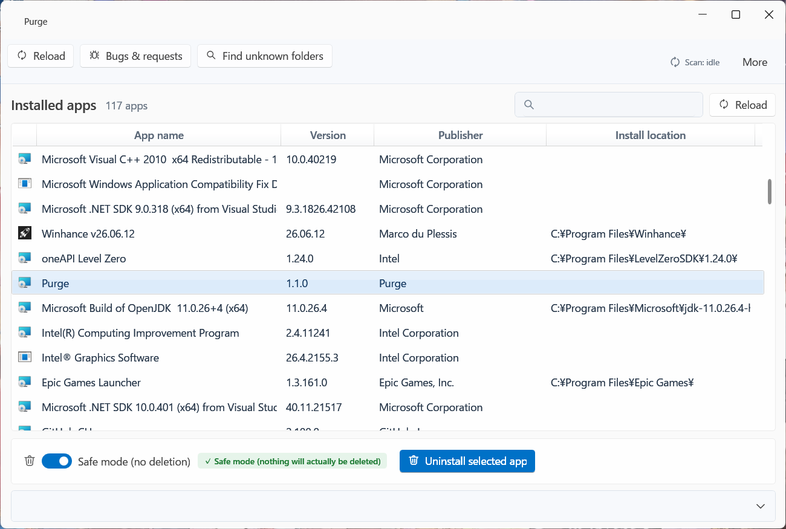
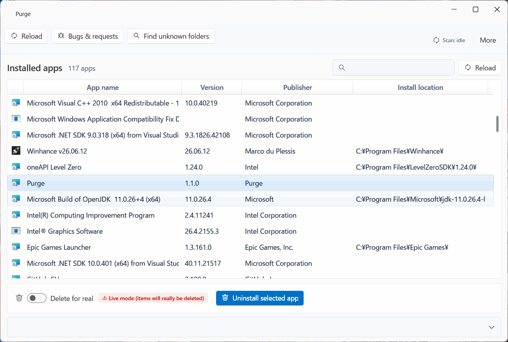

# Purge

[日本語](./README.md) | **English**

[](../../releases)

**A tool that uninstalls Windows apps without leaving anything behind.**

Even after you run a normal "Uninstall", registry values, service registrations,
and orphaned folders can remain on your PC.
Purge finds these leftovers and lets you clean them up safely.

## Who it's for

- You uninstalled an app, but you suspect registry entries or folders are still there
- You've used your PC for a long time and it feels slower
- You want to see what will be deleted before you commit to cleaning

## Download and usage

1. Download the latest installer from [Releases](../../releases)
   - Japanese: `Purge-x.x.x-win-x64-ja.msi`
   - English: `Purge-x.x.x-win-x64-en.msi`
     (the app itself also starts in English, matching the installer's language)
2. Run the installer to install Purge
3. Launch Purge from the Start menu or the desktop shortcut
   (a UAC prompt for administrator rights appears at launch; choose "Yes".
   Without administrator rights, some search features do not work correctly)
4. Pick the app you want to uninstall from the list and run it

You can switch the display language under "More" → "言語 / Language" (Auto / 日本語 / English).
Your choice is kept across restarts and reinstalls.

> **If you see "Windows protected your PC"**
> Purge is currently not code-signed, so Windows SmartScreen may show a warning.
> Choose "More info" → "Run anyway" to continue.

The first time you use Purge, "Safe mode" is turned on.
While it is on, pressing the buttons does not actually delete anything,
so you can check what would be found before moving on to real deletion.

| Safe mode (default) | Execute mode (really deletes) |
|---|---|
|  |  |

## Features

- Lists installed apps and runs their uninstallers
- Searches across the registry, services, Task Scheduler, startup items, and more
  for leftovers that remain after uninstalling
- Finds folders whose owning app is no longer known ("unknown folders")
- Safe mode (a check mode that does not actually delete anything) for pre-checking
- Backup before deletion, and restore from it
  (in addition to files, folders, and registry entries, service and Task Scheduler definitions can also be restored)
- Notification when a new version is available, and downloading the installer from within the app
  (installing the update requires a UAC confirmation)
- Uninstalling Purge itself (from the "More" menu)
- One-click reporting of problems to GitHub Issues

### Pro features (one-time purchase)

On the free edition you can still uninstall apps one at a time and search for and delete leftovers without limits.
The Pro edition adds the following:

- Batch uninstall of multiple apps
- Deleting multiple unknown folders at once
- CSV export of scan results

You can purchase and activate a license from the "Upgrade to Pro" button in the app,
or from "More" → "License activation (Pro)".

## System requirements

- Windows 10 / 11 (64-bit)
- Must be run with administrator rights (required for some search features)

---

## For developers

### Tech stack

- .NET 10 (C#) / WPF
- [WPF UI](https://github.com/lepoco/wpfui) (Fluent Design, MIT license)
- Win32 API (USN Journal, registry operations)
- [WiX Toolset](https://wixtoolset.org/) (MSI installer)

### Project structure

- `Core/` — core logic (app listing, uninstall execution, fast file search, leftover scanning, backup and restore, license verification, etc.)
- `UI/` — the WPF application itself
- `Tests/` — test project (xUnit)
- `installer/` — MSI installers built with WiX (Japanese and English)
- `scripts/` — real-environment verification scripts for installing, self-uninstalling, etc. (run from CI)
- `LicenseKeyIssuer/` — developer-only license key issuing tool (not distributed)

### Building

With the [.NET 10 SDK](https://dotnet.microsoft.com/download) installed, from a command prompt:

```bat
git clone https://github.com/Akatuki1121/Purge.git
cd Purge
dotnet build
```

After building, launch it from a command prompt running as administrator:

```bat
UI\bin\Debug\net10.0-windows\Purge.exe
```

Administrator rights are required (for some registry writes and fast file search access).

Running the tests:

```bat
dotnet test Tests\Purge.Tests.csproj
```

### Releasing

See "リリース手順" (Release procedure) in [ROADMAP.md](./ROADMAP.md) for the release procedure and policy (written in Japanese).
User-facing change history is in [CHANGELOG.md](./CHANGELOG.md) (written in Japanese).

## License

This project uses [WPF UI](https://github.com/lepoco/wpfui).
See [THIRD_PARTY_LICENSES.md](./THIRD_PARTY_LICENSES.md) for details on third-party libraries.