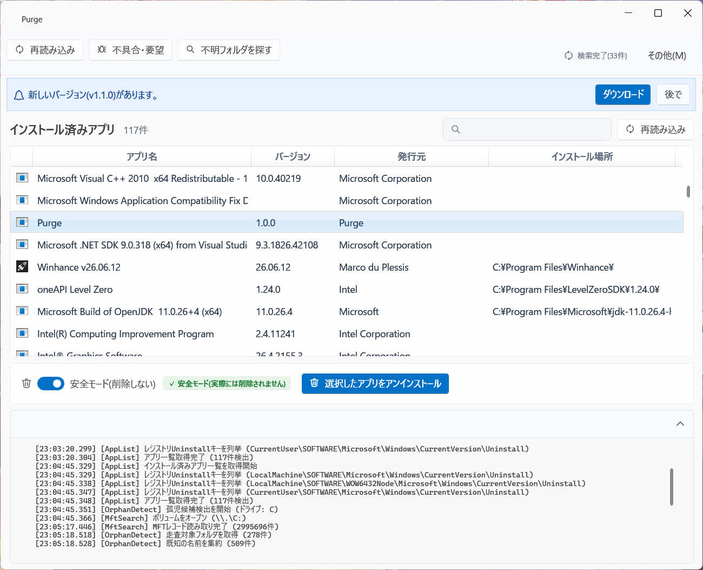
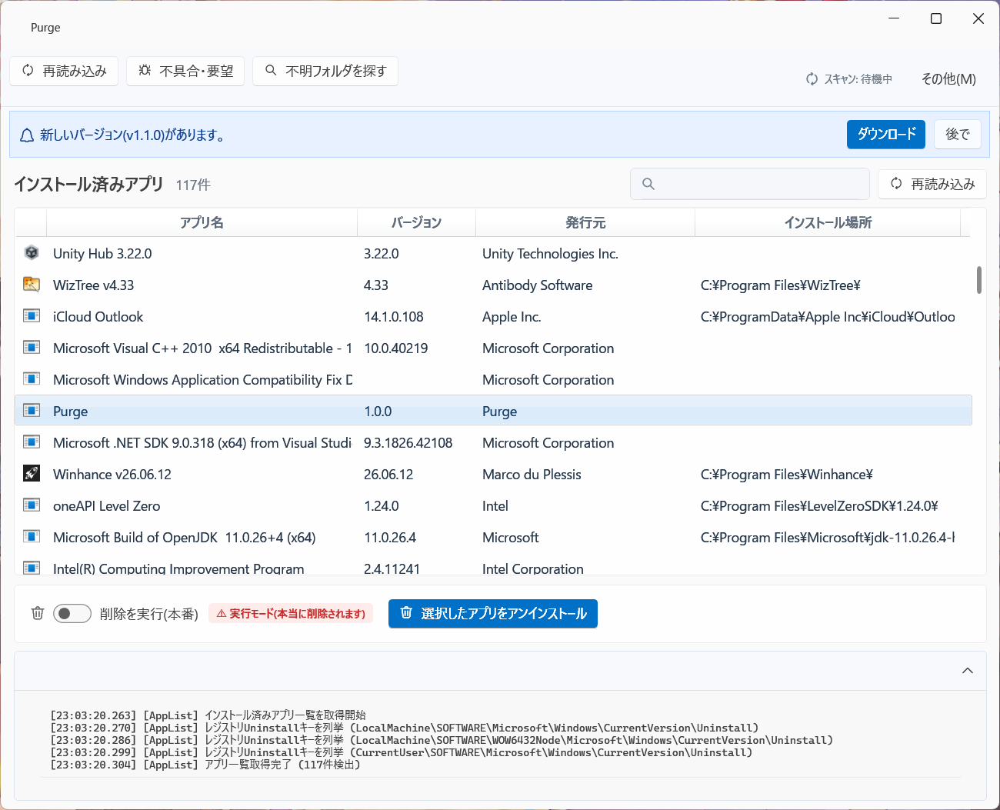

# Purge

**日本語** | [English](./README.en.md)

[](../../releases)

**Windows のアプリを、消し残しゼロでアンインストールするツールです。**

普通の「アンインストール」を実行しても、レジストリの設定値やサービスの登録、
使われなくなったフォルダなどがPCの中に残り続けることがあります。
Purgeはこうした消し残しを見つけて、安全に片付けられるようにします。

## こんな人におすすめ

- アプリをアンインストールしたのに、レジストリやフォルダが残っている気がする
- PCを長く使っていて、動作が重くなってきた気がする
- 何が削除されるか事前に確認してから、安心して片付けたい

## ダウンロードと使い方

1. [Releases](../../releases) から最新のインストーラーをダウンロード
   - 日本語: `Purge-x.x.x-win-x64-ja.msi`
   - 英語: `Purge-x.x.x-win-x64-en.msi`
     (インストーラーの表示言語に応じて、アプリ本体も英語で起動します)
2. インストーラーを実行してPurgeをインストール
3. スタートメニューまたはデスクトップのショートカットからPurgeを起動
   (起動時に管理者権限の確認が表示されるので「はい」を選んでください。
   管理者権限がないと、一部の検索機能が正しく動きません)
4. 一覧からアンインストールしたいアプリを選んで実行

表示言語は「その他」→「言語 / Language」から「自動 / 日本語 / English」に切り替えられます。設定は再起動・再インストール後も保持されます。

> **「WindowsによってPCが保護されました」と表示されたら**
> 現在Purgeはコード署名をしていないため、Windows SmartScreenの警告が出ることがあります。
> 「詳細情報」→「実行」を選ぶと続行できます。

初めて使うときは、画面上の「安全モード」がオンになっています。
オンの間はボタンを押しても実際には何も削除されないので、
まず何が見つかるかを確認してから、安心して本番の削除に進めます。

| 安全モード(初期状態) | 実行モード(本当に削除する) |
|---|---|
|  |  |

## 主な機能

- インストール済みアプリの一覧表示・アンインストール実行
- アンインストール後に残るレジストリ・サービス・タスクスケジューラ・
  スタートアップ項目などの「消し残し」を横断的に検索
- どのアプリのものか分からなくなったフォルダ(不明フォルダ)の検索
- 安全モード(実際には削除しない確認モード)による事前チェック
- 削除前のバックアップと、そこからの復元
  (ファイル・フォルダ・レジストリに加え、サービスとタスクスケジューラの定義も復元できます)
- 新しいバージョンがあるときの通知と、アプリ内からのインストーラー取得
  (更新のインストールには管理者権限の確認が必要です)
- Purge自身のアンインストール(メニュー「その他」から実行)
- 動作中に問題が起きたときの、GitHub Issueへのワンクリック報告

### Pro版限定機能(買い切り)

無料版でも、1つずつのアンインストールと、消し残しの検索・削除は制限なく使えます。
Pro版では次の機能が追加されます。

- 複数アプリの一括アンインストール
- 不明フォルダの複数まとめて削除
- スキャン結果のCSVエクスポート

購入とライセンス認証は、アプリ内の「Proにアップグレード」ボタン、
またはメニュー「その他」→「ライセンス認証(Pro)」から行えます。

## 動作環境

- Windows 10 / 11 (64bit)
- 管理者権限での実行が必要(一部の検索機能に必要)

---

## 開発者向け情報

### 技術スタック

- .NET 10 (C#) / WPF
- [WPF UI](https://github.com/lepoco/wpfui)(Fluent Design、MITライセンス)
- Win32 API(USN Journal、レジストリ操作)
- [WiX Toolset](https://wixtoolset.org/)(MSIインストーラー)

### プロジェクト構成

- `Core/` — ロジック本体(アプリ一覧取得、アンインストール実行、高速ファイル検索、消し残しスキャン、バックアップと復元、ライセンス検証等)
- `UI/` — WPFアプリケーション本体
- `Tests/` — テストプロジェクト(xUnit)
- `installer/` — WiXによるMSIインストーラー(日本語・英語)
- `scripts/` — インストールや自己アンインストール等の実環境検証スクリプト(CIから実行)
- `LicenseKeyIssuer/` — 開発者専用のライセンス鍵発行ツール(非配布)

### ビルド方法

[.NET 10 SDK](https://dotnet.microsoft.com/download) をインストール済みの状態で、コマンドプロンプトから:

```bat
git clone https://github.com/Akatuki1121/Purge.git
cd Purge
dotnet build
```

ビルド後、管理者権限のコマンドプロンプトから起動します:

```bat
dist\dev\Purge.exe
```

`dotnet build`(Debug)は、ビルド結果を `dist\dev\` にもコピーします。ここにある `Purge.exe` が開発版です(`UI\bin\Debug\net10.0-windows\Purge.exe` と同じもの)。
開発版はインストール版と見分けられるよう、アイコンに「DEV」の帯が付き、ウィンドウタイトルが「Purge (Dev)」になり、バージョンが `1.2.1-dev+abc1234` の形式(直近のリリースタグ + コミットハッシュ)で表示されます。起動時の自動更新確認は行いません。

管理者権限が必須です(レジストリの一部書き込み・高速ファイル検索アクセスのため)。

テストの実行:

```bat
dotnet test Tests\Purge.Tests.csproj
```

### リリース

リリースの手順と方針は [ROADMAP.md](./ROADMAP.md) の「リリース手順」を参照してください。
ユーザー向けの変更履歴は [CHANGELOG.md](./CHANGELOG.md) にまとめています。

## ライセンス

このプロジェクトは [WPF UI](https://github.com/lepoco/wpfui) を利用しています。
サードパーティ製ライブラリの詳細は [THIRD_PARTY_LICENSES.md](./THIRD_PARTY_LICENSES.md) を参照してください。
